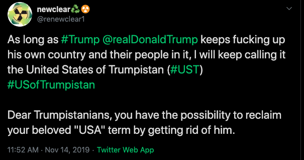

# The former USA(ss) is still the UST (United States of Trumpistan)

# Can I call the UST the USA again already?
No.

# When will that be?
When Trump is no longer president by being either impeached, death, in prison, or no longer (re)elected. When his dictatorship of idiocy has ended, then and only then, you'll be able to reclaim your precious acronym. Until then if you use that acronym, expect us! UST will be everywhere, I'll (try) to make sure of it.

# You're absolutely fucking right, how can I help spread the word?

Share, tweet (that'll annoy him hopefully), make a logo, buy a domain name, write a bot, post it on anything and everything related to UST...

Here is it's inception:

# I'm offended

And you have every right to be in this free world! I'm not sorry. You can make sure that you won't be offended by UST any more by making fucking sure he stops being president as soon as possible.
